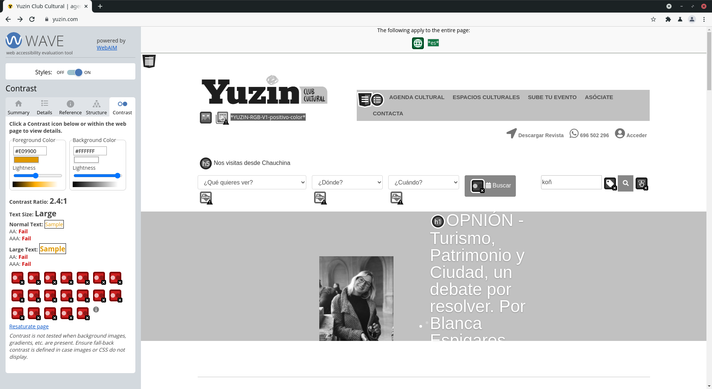
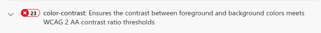

# DIU: EJERCICIO FINAL

Autora: Inés Nieto Sánchez

# PARTE I: MI EXPERIENCIA UX
Antes de cursar la asignatura de Diseño de Interfaces de Usuario las pequeñas interfaces de mis programas no tenían sentido ya que colocaba todo intuitivamente. Sin embargo, esto ha cambiado en estos cuatro meses ya que gracias tanto a las clases de prácticas como a las explicaciones y ejercicios de las clases de teoría he tomado muy buenas bases sobre UI, UX y Usabilidad.

Al comienzo del cuatrimestre empezábamos conociendo que existen distintos tipos de usuarios y que se ha de hacer un ejercicio de empatía a la hora de diseñar una aplicación. Esto supuso de gran ayuda en prácticas donde nos enfrentábamos a la creación de dos personas ficticias. Opté por escoger un verdadero reto en el que tuviera que empatizar con un hombre de 60 años (Onesífero) caracterizado por ser casi analfabeto tecnológico. Para nuestras prácticas supuso encontrar en el desarrollo de los Journey Map aquellos pequeños detalles que damos por sabidos y que son normales en una aplicación, pero que para personas como esta resultan confusas o complejas.

Tras esta primera toma de contacto, comenzamos el Diseño Centrado en el Usuario donde se nos hacía una introducción al proceso que se sigue en la UX. Para esta parte tuvimos que realizar un ejercicio de etnografía, en este a partir de un timbre que encontré paseando por Granada se vio que mucho de los objetos de los que nos rodeamos en nuestro día a día pueden parecer ambiguos o confusos a personas que no frecuentan su uso. Profundizando aún más en la empatía para centrarnos en el usuario, realizamos una actividad de un Feedback Capture Grid y un Empathy Map sobre las fotografías físicas y online en tiempos de covid, en esta actividad junto con mis compañeros de grupo pudimos poner en palabras qué siente, piensa, escucha o dice una persona en este contexto o cuáles son los pros y contras encontrados. Esto nos preparó para aplicarlo en nuestra segunda práctica, donde optamos por un empathy map el cual nos ayudó a conocer las inquietudes o influencias externas que pueden tener dos usuarios con dos perfiles totalmente distintos en el contexto de la planificación de un viaje.

Continuando con la práctica 2 en esta se proponía la realización de un Task Analysis el cual llevamos a cabo a través de la Task Matrix vista en las clases de teoría. Con esto mi compañero y yo pudimos comenzar el diseño de una nueva aplicación de planificación de viajes dividiendo las distintas tareas que se llevan a cabo según el tipo de usuario, así como estructurar nuestra aplicación en base a ello haciendo uso de un Sitemap visto en teoría también. De igual forma se nos dieron unas pautas para la creación de un Mockup empezando por un wireframe cuya importancia es proveer al diseñador de la visualización de los "cimientos" de la aplicación.A partir de este prototipo, logramos un diseño minimalista e intuitivo siempre teniendo en cuenta las necesidades de los usuarios analizadas anteriormente. Además, para la creación del mockup tuvimos que aprender a utilizar AdobeXD, un programa muy popular entre los diseñadores UX. 

Una vez se finalizó el proceso anterior, comenzábamos con el UX-Case Study, donde aprendimos en clase la importancia del lenguaje visual, de la psicología de los colores y cómo se realiza correctamente el diseño de un Moodboard. Todo esto se llevó a la práctica en la tercera práctica, donde le di bastante importancia a las ideas que se querían transmitir al usuario, así como el color en la realización del moodboard, pues con nuestra aplicación quería que el usuario la asociara en todo momento a viajar. Por ello buscamos inspiración en distintas imágenes de distintos lugares a los que se pueden viajar como son una playa, un pueblo o una ciudad. Estas imágenes poseían colores (naranja, azul, verde...) muy dispares entre sí, pero que combinados de una forma correcta funcionaban muy bien juntos. Para la estructura de la aplicación, además de seguir nuestro Wireframe investigamos sobre las Guidelines de Android para mantener su estructura y consistencia. De esta forma finalmente diseñamos nuestro Mockup junto con su Case Study. Mi prinicipal idea en la realización del Case Study es que no resultara aburrida la presentación de la historia de la aplicación, es por esto que tanto mi compañero y yo introducimos ciertos elementos cómicos que hicieran más amena su visualización. En el diseño de la aplicación (bautizada como Lolis) se ha buscado en todo momento el minimalismo y la máxima simplicidad posible para que la aplicación no resultara compleja al usuario, pero siempre manteniendo cierta frescura. 

Para concluir con las prácticas se realizó un A/B testing con la aplicación de otros compañeros. En este caso me pareció mejor idea compartir la encuesta sobre las dos aplicaciones en redes sociales y que los usuarios se decantaran por la que más le llamara la atención por su nombre que crear usuarios fictios a partir de los dados. Con este A/B testing nos dimos cuenta qué puntos débiles/fuertes presentaba nuestra aplicación frente a otra y qué se podía mejorar en base a las opiniones de los distintos usuarios.

Para finalizar la asignatura se concluyeron con dos ejercicios de Usabilidad y Accesibilidad. En el primero de ellos tuvimos que hacer el estudio sobre universidades andaluzas y aquí comprobé que una universidad de una de las principales ciudades de Andalucía como es Málaga poseía una página web que dejaba mucho que desear en cuanto a usabilidad se refiere. De igual forma ocurrió en el estudio de Accesibilidad para el ayuntamiento de Málaga que carecía de mínimos como es el contraste de colores.

Esta asignatura combinándose junto con la de Desarrollo del Software donde hemos aprendido a programar en Android Studio o Sistemas de Información Basados en Web donde hemos aprendido HTML, CSS y JavaScript me han dado las suficientes herramientas para crear mis propias aplicaciones o sitios web haciéndolas atractivas, usables y cómodas al usuario.

# PARTE II: Caso de estudio. [Web YUZIN](https://yuzin.com/)

## INTRODUCCIÓN
Nos encontramos ante la página web de una empresa de divulgación de enventos culturales en Andalucía llamada YUZIN. Esta empresa explica que tiene como objetivo promover e incentivar el consumo de la cultura local convirtiéndose en la unión entre el público y los agentes culturales. Para ello YUZIN a través de su revista mensual o con un listado muestra al usuario los próximos eventos culturales (conciertos, teatro, poesía, visitas guiadas a monumentos...) de las ciudades en las que trabaja la empresa, ofreciendo a sus usuarios ventajas como descuentos o acceso a actividades exclusivas si se suscriben a su club. Además, permite a los promotores culturales subir sus eventos y vender las entradas en la página web.

La página se ha mantenido con un diseño bastante obsoleto desde 2004 hasta 2018, en el año 2019 le dieron un nuevo lavado de cara. En este rediseño la revista que en años atrás poseía mayor protagonismo ha acabado en un segundo plano, pasándole el protagonismo a la muestra de eventos culturales y compra de entradas online. Esto último lo considero un acierto ya que actualmente en comparación a hace unos años no se leen a penas revistas y se prefiere buscar directactamente la información de un evento en concreto.

A continuación se realizará un análisis de este nuevo diseño comprobando si la experiencia de usuario ha sido mejorada y se procederá a realizar un rediseño de la página en base a lo analizado.

### 1.ANÁLISIS

### Usability Review
Para la realización del análisis del sitio web se ha optado por hacer un Usability Review con el cual se ha "diseccionado" la página para extraer las carencias y fallos que presenta ésta, así como sus puntos fuertes. 

De este Usability Review hemos obtenido que la puntuación final de la página ha sido de 62 puntos (Moderado) y hemos comprobado que Yuzin presenta múltiples fallos, siendo los principales los siguientes: 

- No destaca sus funcionalidades principales y da mayor relevancia a secciones secundarias como los articulos de opinión.
- No es posible hacerse miembro del club a no ser que se pase por el proceso de compra de entradas de un evento.
- El menú es poco intutivo para un usuario novato.
- Una de las dos opciones de búsqueda ofrecidas (búsqueda por palabras clave) no cumple con su funcionalidad. 
- No ofrece ningún tour por la página y no es fácil de encontrar una sección de ayuda, pues el FAQ ofrecido se encuentra en el footer y éste sólo resuelve dudas sobre la empresa. Si se necesita ayuda sobre la página hay que acceder a la sección de "Contacta" y rellenar un formulario, escribir un email o llamar por teléfono a uno de los números de contacto. Todo lo anterior resulta poco intuitivo y demasiado complejo para una simple duda sobre la página.
- EL feedback es algo pobre, pues los errores devueltos no especifican claramente qué ha falla y en cuanto a la navegación por la página no se destaca la sección en la que el usuario se encuentra ni se proporciona la ruta de navegación.
- Añade elementos que no tienen ninguna función como al final de la página principal con título "Actualidad Cultural".
- No redimensiona correctamente con la ventana del navegador.
- El constrate elegido de amarillo sobre blanco no es adecuado.

A pesar de estos defectos, también se ha encontrado que Yuzin destaca positivamente por lo siguiente:
- La página web es fácil de encontrar en los buscadores.
- La interfaz es sencilla y no está saturada.
- Presenta un buen rendimiento, la página carga rápido.
- Se priorizan los eventos destacados en las búsquedas de eventos.
- Los formularios utilizan los campos de entrada apropiados.
- La fuente elegida se lee fácilmente.

Para acceder al documento del Usability Review pulse [aquí](Análisis/Usability-review-Yuzin.pdf).

### Accesibilidad
Se ha realizado un estudio de accesibilidad para comprobar que la página permite el acceso a todo el público a pesar de padecer discapacidades como el daltonismo. 

Para este estudio se han hecho uso de los plugins WAVE Web Accessibility Evaluation Tool, Accessibility Insights for Web y Funkify.

El mayor problema encontrado señalado tanto por WAVE como por Accessibility Insights for Web es la falta de constraste. Sólo basta con desaturar la página para darnos cuenta de esto:

 
 

Probando la opción "Trembling Trevor" de Funkify se comprueba que resulta muy difícil hacer click sobre una opción o con "Blurry Bianca" se comprueba que para personas miopes los textos con un tamaño de fuente pequeña son muy complicados de leer.

Sumado a estos problemas, la página no presenta ninguna sección de información sobre Accesibilidad. Por esto se deduce que en este sitio web no se tiene en cuenta la accesibilidad para todos los públicos.

